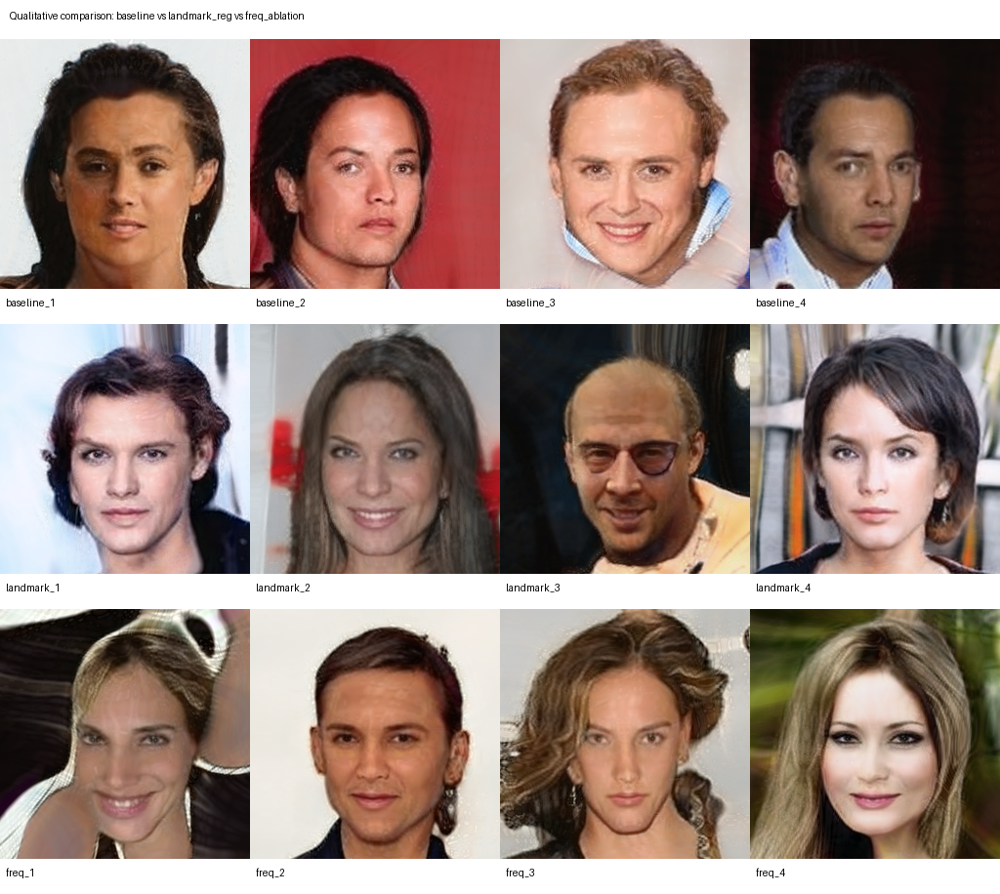

# Realistic Face Image Generation with Landmark-Regularized StyleGAN3-R

  <b>Deep Learning Project on realistic face generation, geometry-aware regularization, and personal-face perturbation analysis</b>

  

## Abstract

This project pipelined for **realistic face image generation** utilizing **StyleGAN3-R** on the **CelebA** dataset at a **256×256** resolution. The core objective of this research is to improve facial geometry consistency without collapsing output diversity. 

The repository provides a comprehensive workflow encompassing a fine-tuned baseline, a novel geometry-aware regularization method, exploratory frequency ablations, and a robust perturbation analysis.

### Main Contributions

* **Baseline Formulation:** A StyleGAN3-R architecture fine-tuned from the official FFHQ-U 256×256 pretrained checkpoint on the CelebA dataset.
* **Proposed Methodology:** A landmark-based regularization technique leveraging facial geometry statistics to anchor generated outputs to realistic geometric distributions.
* **Ablation Study:** An exploratory frequency-aware regularization approach to evaluate spectral control impacts on generation behavior.
* **Perturbation Analysis:** An extensive personal-face perturbation experiment comprising 15 original–perturbed image pairs, evaluated utilizing FaceNet-based verification and visual similarity metrics.

---

## Methodology

### 1. Baseline Model
The foundational architecture is **StyleGAN3-R**, initialized via the official **FFHQ-U 256×256** weights. This model undergoes fine-tuning on the CelebA dataset (packaged at 256×256) up to **50 kimg** to establish a stable reference state.

### 2. Landmark-Regularized Model (Proposed)
To mitigate geometric distortions, facial landmark-based geometric features are extracted from real CelebA distributions. These statistical priors are formulated into a regularization term integrated during the GAN training phase (trained for **5 kimg**). This enforces structural plausibility, ensuring generated faces adhere closer to empirical facial-geometry bounds.

### 3. Frequency Ablation
An auxiliary frequency-aware regularization term is introduced and trained for **3 kimg**. This exploratory ablation tests the hypothesis that targeted spectral control can further constrain and refine generative behavior.

### 4. Personal-Face Perturbation Experiment
A targeted robustness evaluation is conducted using a single, aligned personal face image. The subject is subjected to a battery of image-space transformations, including:
* Gaussian noise and blurring
* JPEG compression artifacts
* Luminance and contrast variations
* Minor rotational shifts
* Feature occlusion (eyes and mouth)
* Downsample–upsample distortion loops

Evaluation of the perturbed variants against the original baseline is quantified using FaceNet cosine similarity, Structural Similarity Index Measure (SSIM), Peak Signal-to-Noise Ratio (PSNR), and Learned Perceptual Image Patch Similarity (LPIPS).

---

## Quantitative Results

Metric evaluations were conducted rigorously on **1000 real** and **1000 generated** images per model variant.

### Generation Models Performance

| Architecture | FID | FID Status | LPIPS Diversity | Landmark Plausibility (↓) | Remarks |
| :--- | :--- | :--- | :--- | :--- | :--- |
| **Baseline** | 152.03 | Usable | 0.566 | 7.53 | Stable reference model |
| **Landmark Regularized** | 3.36 × 10²⁰ | Unstable | 0.572 | **6.23** | **Best geometry/plausibility** |
| **Frequency Ablation** | 3.49 × 10³⁰ | Unstable | 0.581 | 6.36 | Exploratory evaluation |

> **Interpretation Note:** > The modified-run FID/KID metrics exhibit numerical instability within the final evaluation framework. Consequently, the **baseline FID** should be utilized as the primary reference for realism. The **landmark plausibility score** serves as the primary quantitative evidence supporting the proposed regularization method, augmented by the LPIPS diversity metrics. Treat modified-run FID values with academic caution.

### Personal-Face Perturbation Experiment

| Evaluation Metric | Recorded Value |
| :--- | :--- |
| Total Evaluated Pairs | 15 |
| Attack Success Rate | **100%** |
| Mean SSIM | **0.854** |
| Mean PSNR | **26.01 dB** |
| Mean LPIPS | **0.126** |

---
